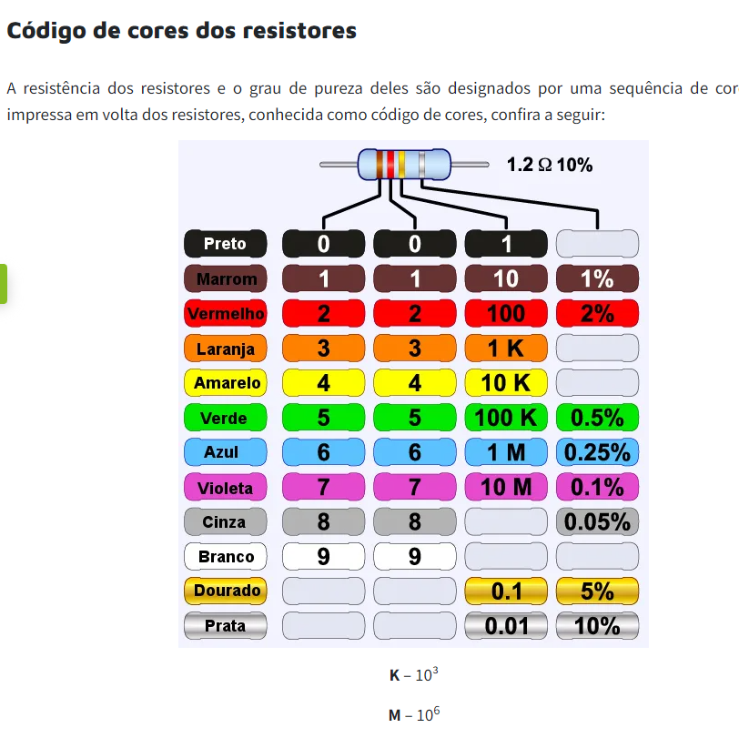
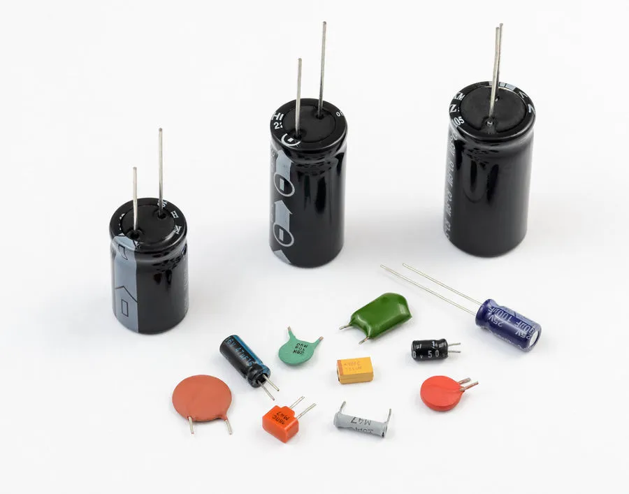

### Bons condutores elétricos 
- Prata
- Cobre 
- Ouro
- Alumínio
- Ferro
- Grafite

### Bons isolantes 
- Vidro
- Parafina
- Plásticos
- Teflon

### Componentes eletronicos

- Resistor
é um componente eletrico cuja principal função é limitar o fluxo de cargas elétricas, ele vai virar um funil para barrar boa parte da energia elétrica para deixar passar uma quantidade mínima de energia.

- Capacitores
Servem para armazenzar elétrons

### componetes ativos

- Diodo 
Permite que a energia passe por um único sentido.

- Transistor
Possui duas funçoes básicas: amplificar a corrente elétrica ou barrar a sua passagem.